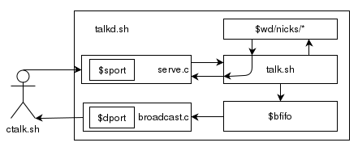

# Description
This contains a basic chat server, constituted from
pieces of C code glued together by shell.

The C tools are available at
[github.com/m-b-/utils](https://github.com/m-b-/utils/).

This is very unlikely to scale, but should works fine for
a few dozens of users.

This has only been tested with bash on a Linux so far.

# Requirements
To get and compile the previous tools, you need curl(1)
and a cc(1), or do it by hand :-)

To actually use the script, you only need standard tools:
a sh(1), sed(1), awk(1), etc. One also need a netcat.

If you don't have netcat (!) you may use either `client.c`,
or `nc.go`, or better, get one yourself (quite some are
referenced on [sectools.org](http://sectools.org/tool/netcat/)).

# Protocol
## Send
| command | arguments | definition                   |
|---------|-----------|------------------------------|
| !iam    | nickname  | set nickname                 |
| !list   |           | list all users               |
| !quit   |           | disconnect                   |
| !leave  |           | disconnect                   |
| !msg    | nick, msg | send private message to nick |
| !say    | msg       | send public message          |

Client must first send an `!iam <nickname>`. Later
`!iam` are un-interpreted. Message whose first word
is not listed above are interpreted as a `!say`.

Note that an empty line also disconnect the client. This
is a bit of a hack to detect client closing socket. If
you do want to say nothing, use `!say` :-)

## Receive
Classic conversation output is in the form:

	<nick> nick's message

Private message are prefixed by a dash followed
by a space:

	- <nick> nick's private message

Server message starts with a star:

	* nick has logged in

# Configuration
Configuration is a source'd file containing the following
variables:

	# working directory containing nicks/ and $bfifo
	wd=/tmp/talk.d/
	# port used by serve.c
	sport=9000
	# port used by broadcast.c
	dport=9001
	# broadcast fifo
	bfifo=$wd/broadcast-unix

# Architecture

Mainly:

- an input port, to `serve.c`
- an output one, from `broadcast.c`
- a fifo created by `lockf -f` per client in `$wd/nicks/` from which
one can send/receive private message
- a fifo for broadcast `$bfifo` to broadcast messages
to all.

# Example usage

Get, compile and launch:

	(server)% ./install.sh
	...
	(server)% edit config
	(server)% ./talkd.sh
	...

Launch client:

	(client)% ./ctalk.sh
	!iam whatever
	...

# Files

	- talkd.sh is daemon
	- talk.sh is script served to each client
	- ctalk.sh is working, raw sample client
	- ctalk.c is a barely working, ncurses client
